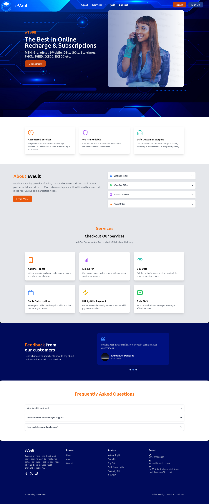
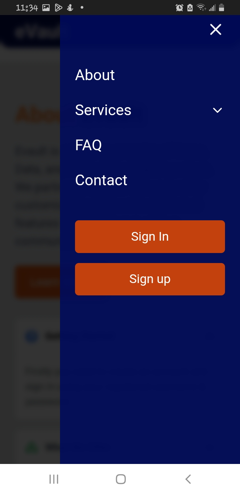

# evault-frontend

This is a React-based web application using Vite as the build tool. Tilwind CSS is used for styling, and the code is written in JSX for easier modification.
    

## Screenshots:

### - Desktop 



### - Mobile


 

 



## Project Setup

To set up the project locally, follow these steps:

1. **Clone the repository:**

   ```bash
   git clone https://github.com/your-username/evault-webpage.git
   cd evault-webpage

    Install dependencies:

    Make sure you have Node.js and npm installed on your machine. Then, run:
    bash

npm install

Start the development server:
bash

    npm run dev

    This will start the development server and open the application in your default browser.


Available Scripts

In the project directory, you can run:

    npm run dev: Runs the app in the development mode.
    npm run build: Builds the app for production.
    npm run preview: Previews the production build locally.